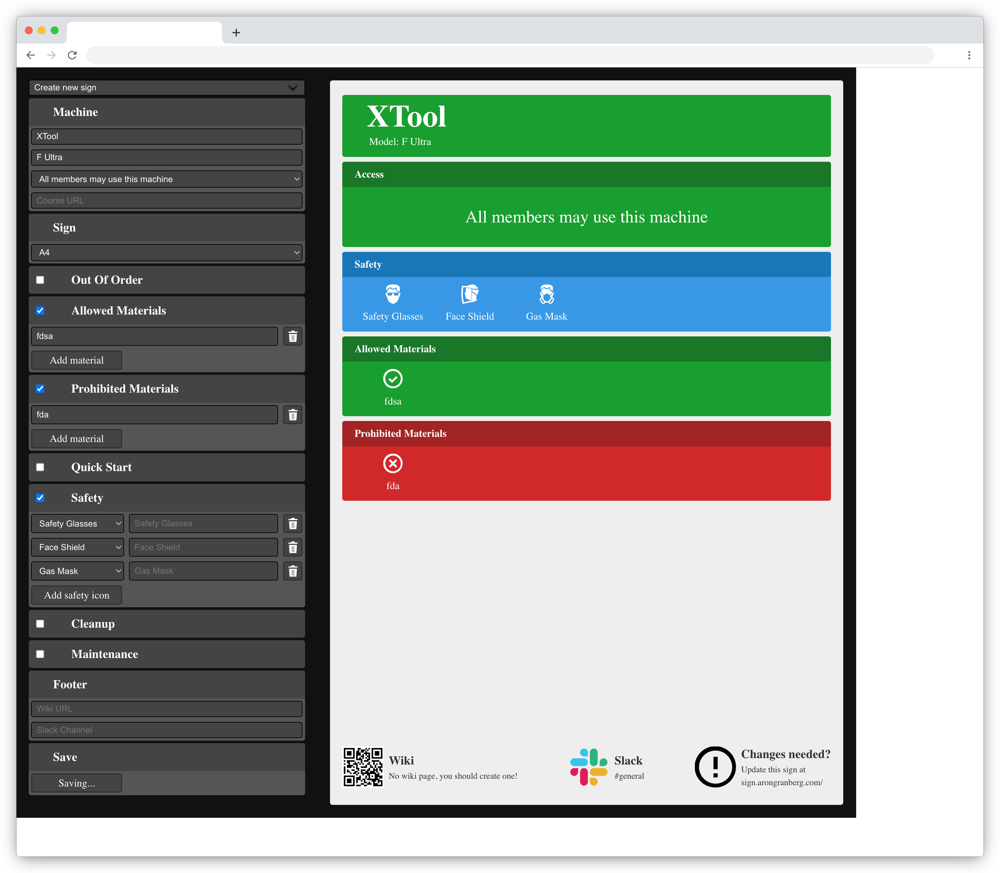

# MakerSpace Machine Sign

This is a React-only fork of the [makerspace machine-sign](https://github.com/makerspace/machine-sign) repository.

Hosted at https://machinesign.greycastle.se

This project *can* be hosted on Github Pages directly without a custom url but it requires a lot more configuration of urls so using a custom url is recommended.



## Running

```shell
yarn install
yarn dev
```

## SPA configuration

Since this is a React SPA (single page application), we need to GitHub pages to direct any url to open with the index.html file.

By using [ghspa](https://github.com/websemantics/gh-pages-spa) and providing a `404.html` file, we can redirect missing (all non-root urls) to the index.html file.

