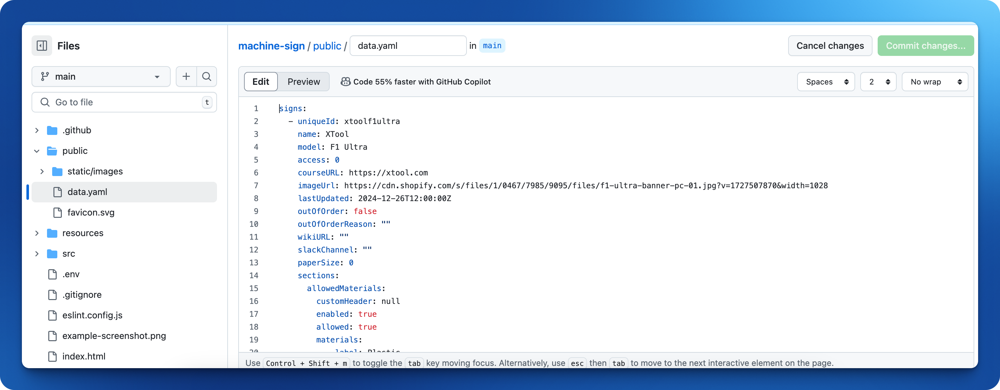

# MakerSpace Machine Sign

This is a React-only fork of the [makerspace machine-sign](https://github.com/makerspace/machine-sign) repository.

Hosted at https://machinesign.greycastle.se

This project *can* be hosted on Github Pages directly without a custom url but it requires a lot more configuration of urls so using a custom url is recommended.


## Running

```shell
yarn install
yarn dev
```

## Saving data

All pre-existing data is stored in the [public/data.yaml](https://github.com/ddikman/machine-sign/edit/main/public/data.yaml) file.

When editing an item, the yaml can be copied to clipboard. You can take this and edit the yaml file directly in GitHub to persist the changes.

This is a a bit cumbersome and a temporary solution but it avoids having to mess with data storage and authentication.



## SPA configuration

Since this is a React SPA (single page application), we need to GitHub pages to direct any url to open with the index.html file.

This is done in the [deploy.yaml](.github/workflows/deploy.yaml) very simply by providing a `404.html` which is a copy of the `index.html` file.